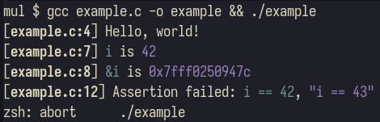

# MUL: Miles's Utility Library

A collection of utilities for debugging C programs.

- ANSI-escape sequence colors
	-  All colors can be disabled by defining `MUL_COLOR_DISABLE`
	- `MUL_COLOR_BOLD`
	- `MUL_COLOR_RED`
	- `MUL_COLOR_GREEN`
	- `MUL_COLOR_YELLOW`
	- `MUL_COLOR_BLUE`
	- `MUL_COLOR_MAGENTA`
	- `MUL_COLOR_CYAN`
	- `MUL_COLOR_RESET`
- Logging
	- Logging can be disabled by defining `MUL_LOG_DISABLE`
	- `MUL_LOG(message, ...)` follows `printf()`-style formatting
- Assertions 
	- Assertions can be disabled by defining `MUL_ASSERT_DISABLE`
	- `MUL_ASSERT(condition, messsage, ...)` follows `printf()`-style formatting and `abort()`s if `condition` is false-y
- "What-is"
	- The "what-is" function-like macro is disabled if not compiling with GNU C
	- `MUL_WHAT_IS(x)` is available for all built-in C types (if you find one missing, please open an issue)

# Example

```c
#include "mul.h"

int main(void) {
	MUL_LOG("Hello, world!");

	int i = 42;
	MUL_WHAT_IS(i);
	MUL_WHAT_IS(&i);

	MUL_ASSERT(i == 42, "i == %d", i);
	i += 1;
	MUL_ASSERT(i == 42, "i == %d", i);

	return 0;
}
```


